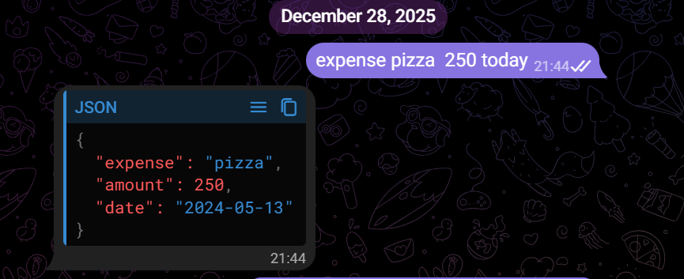

AI Expense Tracker using n8n

This project is an automated expense tracker built using **n8n workflows**.
Users can log expenses via Telegram text , and the data
is automatically extracted and stored in Google Sheets.

 Features
- Log expenses from Telegram messages
- Extracts expense name, amount, and date
- Supports natural language (e.g., "coffee 120 today")
- Voice transcription support using Deepgram
- Fully automated workflow using n8n

---

Tech Stack
- n8n (Workflow Automation)
- Telegram Bot API
- Gemini (Speech-to-Text)
- Google Sheets

---

 How to Use
1. Import the workflow JSON into n8n
2. Configure Telegram, Gemini, and storage credentials
3. Run the workflow
4. Send an expense message on Telegram

---
Screenshots

# Workflow

# Telegram Input

# Google Sheets Output

##  Files
- `expense tracker.json` → n8n workflow export
This project was built as a practical automation + AI integration project.
